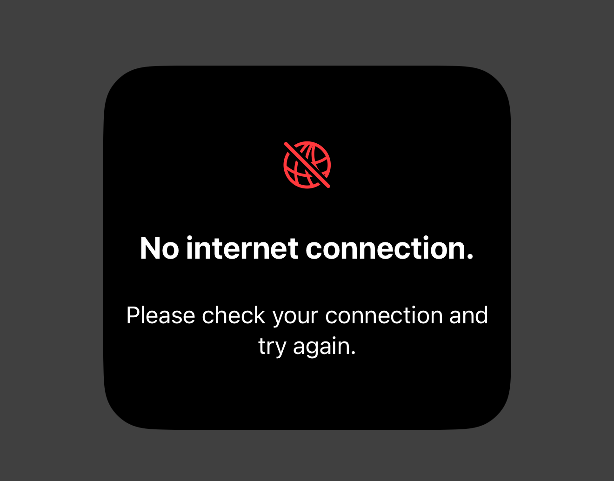
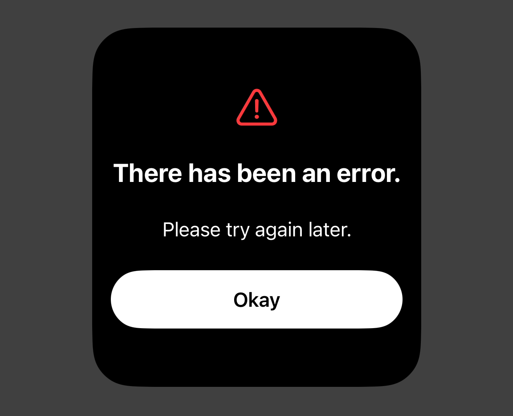
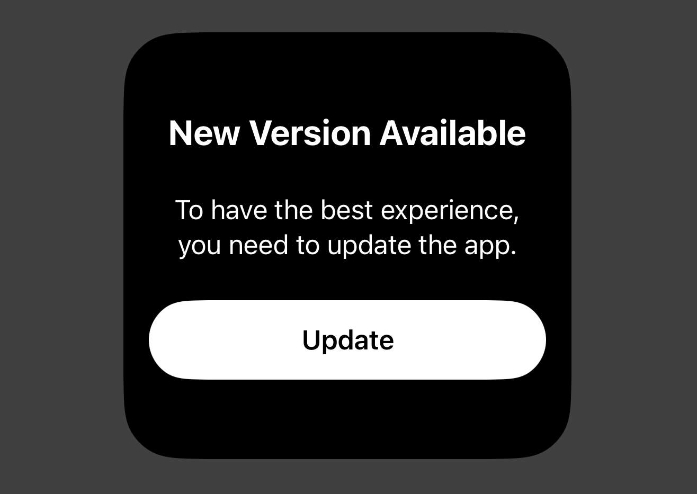
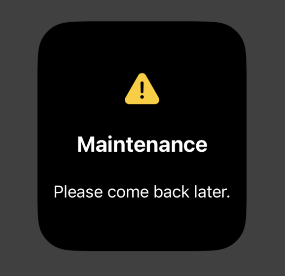
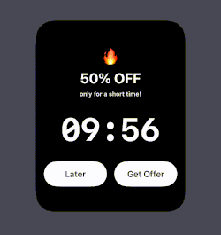
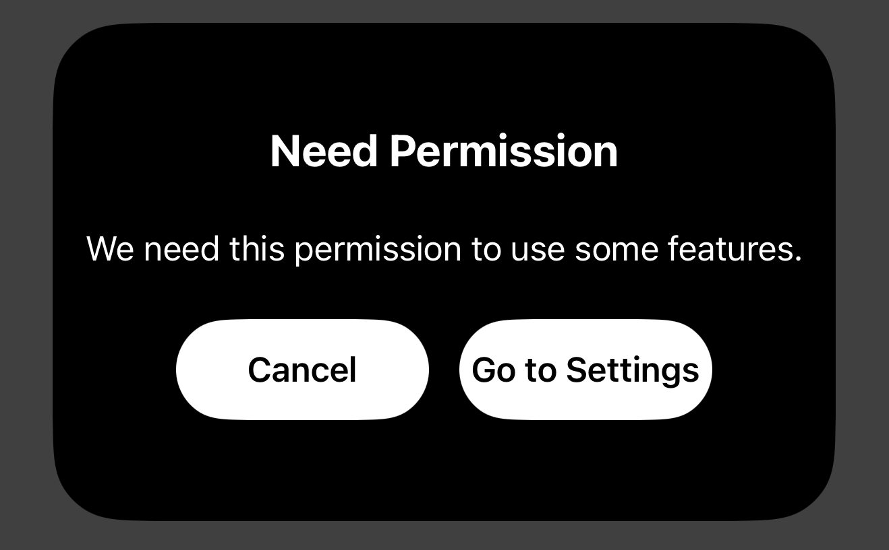
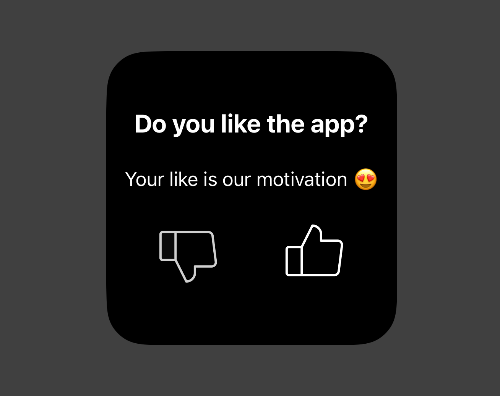
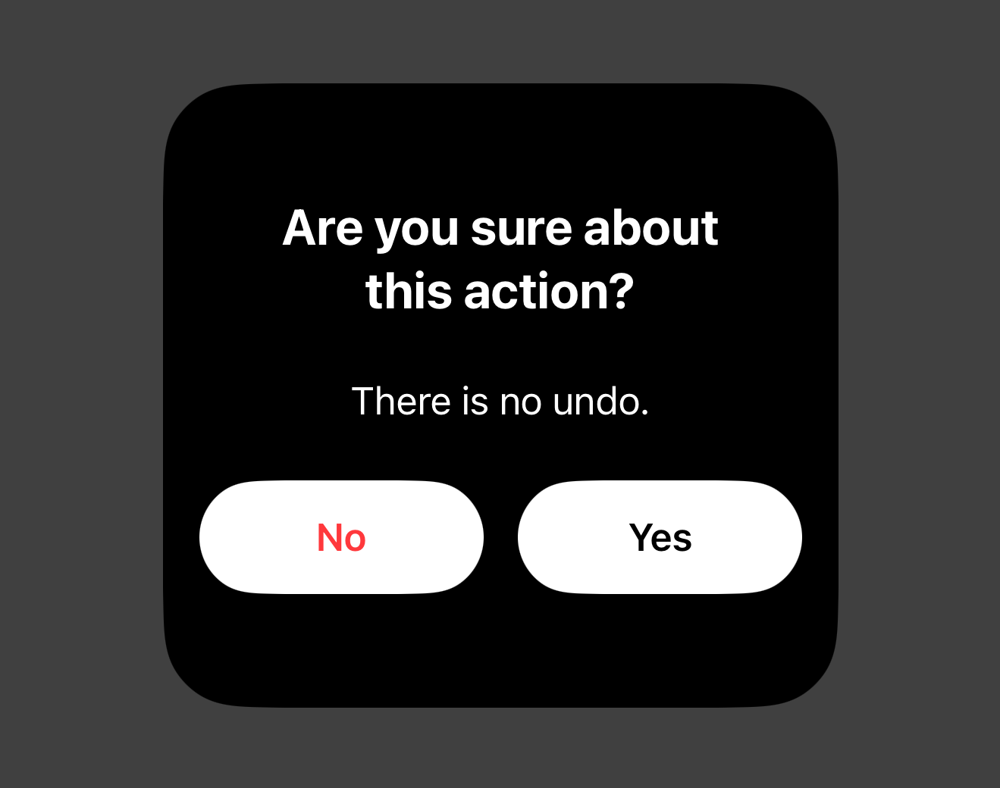
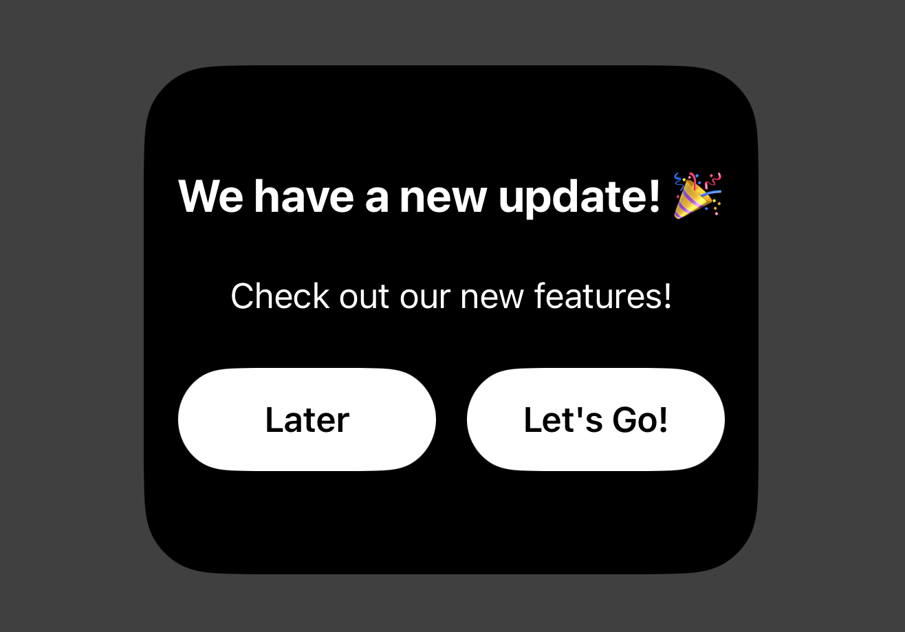

# PopupKit

A centralized SwiftUI Popup SDK designed to handle all the application's messaging needs—from critical alerts to marketing offers—with a single line of code.

---

## Features

- **🛠 Specialized Popup Types**: Pre-built layouts for almost every mobile app scenario.

- **🛠 Centralized Management**: Trigger popups from ViewModels or Views using PopupManager.shared. No more state bloat. 

- **📦 Global Hosting**: Use the .popupHost() modifier once at the top level and let the SDK handle the rest.

- **✨ Smooth Transitions**: Integrated spring animations and background dimming.

---

## Popup Types

- **.connection**: Handling lost internet or offline states.



- **.error**: Displaying API failures or unexpected issues.
  


- **.forceUpdate**: Blocking the app until the user updates to the latest version.
  


- **.maintenance**: Informing users about scheduled server downtime.
  


- **.offer**: Marketing campaigns or discount announcements.
  


- **.permission**: Explaining why you need camera, photo, or location access.
  

  
- **.rating**: Encouraging App Store reviews at the right moment.
  


- **.warning**: Cautioning users before a destructive action.
  


- **.whatsNew**: Showcasing new features after an app update.
  


---

## Installation

Swift Package Manager (SPM)
In Xcode, go to File > Add Packages...

Enter the repository URL: [BKPopupKit](https://github.com/FallikTheCat/BKPopupKit)

Select Up to Next Major Version and click Add Package.

---

## Usage

### 1. Set up the Host
Attach the .popupHost() modifier to the root view (usually in the App struct or ContentView). This allows popups to appear over the entire navigation stack.

```swift
import SwiftUI
import BKPopupKit

@main
struct MyApp: App {
    var body: some Scene {
        WindowGroup {
            ContentView()
                .popupHost() // The magic happens here
        }
    }
}
```

### 2. Trigger from Anywhere
Since the SDK uses a Shared Manager, don't need to pass bindings. Just call present().

```swift
Button("Trigger Warning") {
    PopupManager.shared.present(.warning)
}
```
